# Experiment Studio — UI audit, 2026-07-17

**Target:** Experiment Studio 0.7.0 (`main` @ `d3b022f`), captured on the local devserver and on
preprod. All file paths below are under `webapp/frontend/src/` unless stated otherwise.

**Method:** the audit design doc,
`docs/superpowers/specs/2026-07-17-experiment-studio-ui-audit-design.md`. The app was driven live;
no application code was changed (see *Method & coverage limits*).

**Coverage:** 42 states, each probed at 3 viewports (1024×720, 1280×800, 1920×1080) and judged at
1440×900. **0 states uncaptured — no coverage gaps.** Preprod added 6 real-hardware states (real
roster, real records) that the local FakeLab cannot produce.

---

## Summary

| Severity | Count |
|---|---:|
| S1 — broken | **0** |
| S2 — degraded | **11** |
| S3 — polish | **13** |
| **Total** | **24** |

No S1: nothing found makes a task impossible at a supported viewport.

**Two tracks.** Track A (mechanical) ran an automated probe that emitted **36,873** rows and
deduplicated them to **5 measured root causes** plus 1 behaviourally-proven overlap. Track B
(judgment) had eight component reviewers produce **41** raw findings; an adversarial skeptic pass —
each finding defaulting to *refuted* and re-checked live — **refuted 23** and **verified 18**. The
24 findings below are only those that survived both tracks' scrutiny; the raw duplicates, the
settled decisions, and the refuted claims are **not** counted here.

Findings are ordered severity-first, then by how many states each affects: a shared-component
defect that fires in dozens of states is ranked above a one-off.

---

## S2 — degraded

### 1. Structural body text and captions fail AA contrast across every tab
**Component:** on-canvas labels, lane/branch captions, EventLog timestamps, Inspector section
headers · **Track:** mechanical (measured).
**File:** `builder/Canvas.tsx:193,199,286-287,329,345-346`, `run/EventLog.tsx:61`,
`builder/Inspector.tsx:137-139,463,321`. **Viewport:** all three probe viewports evenly.

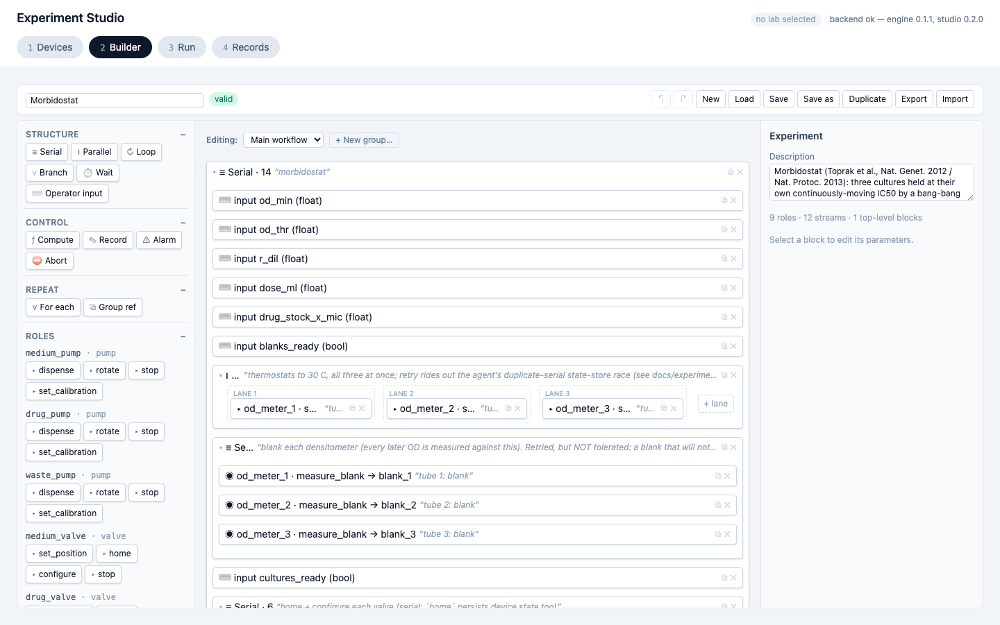

**What's wrong:** `slate-400` (rgb 144,161,185) measures **2.63:1** on white, **2.51:1** on
slate-50, and **2.40:1** on slate-100 — all below the 4.5:1 AA floor for normal text. Unlike the
hover icons in finding 2, this is always-visible text that carries real meaning: the `▾` toggle,
block labels, the lane and branch/then/else captions, log timestamps, and Inspector section
headers. 7,393 measured rows across Builder, Run, and Records. In the screenshot the greyed captions
(`morbidostat`, `LANE 1/2/3`, the italic block labels) are the affected text.
**Why it matters:** the on-canvas explanation of *why* a block exists — the thing an author reads to
understand a workflow — is the hardest text to read, and it fails on the realistic demo
(morbidostat-main contributes 192 rows, morbidostat-group 117), not only the torture fixture.
**Suggested fix:** darken the caption/label colour to at least `slate-600` at the listed lines.

### 2. Per-card action icons are both near-invisible and under-tappable
**Component:** hover-reveal card action icons (⧉ Duplicate, ✕ Delete, ✎ Record edit, "drop here")
· **Track:** mechanical (measured).
**File:** `builder/Canvas.tsx:215,225`, `builder/DropSlot.tsx:25`, `records/RecordsTable.tsx:67,135`,
`builder/LoadDialog.tsx:106,113`, `records/WorkflowSnapshot.tsx:49`. **Viewport:** all three, evenly.

**What's wrong:** one idiom repeated across five files renders the per-row action icons in
`slate-300` (rgb 202,213,226) on white — **1.49:1**, close to invisible at rest — at **9×16px**,
under the 24px touch-target minimum. 11,238 contrast rows + 11,088 tiny-target rows across 30
states; **0 of 14,207 tiny-target rows have both axes ≥ 24px**. Because the icons are hover-reveal,
they are only faintly present in a static screenshot (the ⧉/✕ pairs at the right edge of each card).
**Why it matters:** the primary per-card controls (duplicate, delete) are simultaneously hard to see
and hard to hit; the pattern reaches the realistic doc (morbidostat-main = 252 rows).
**Suggested fix:** raise the resting contrast (e.g. `slate-500`) and pad the hit area to ≥ 24px.

### 3. Interactive controls fall below the 24px target-size minimum
**Component:** the `▾` collapse toggle and other small controls · **Track:** mechanical (suspicion).
**File:** `builder/Canvas.tsx:193` (the `▾` toggle, **5.7×16px** — the narrowest control in the app),
`run/InputDialog.tsx:106` (the `—` hide button, 13.7×24). **Viewport:** all three.

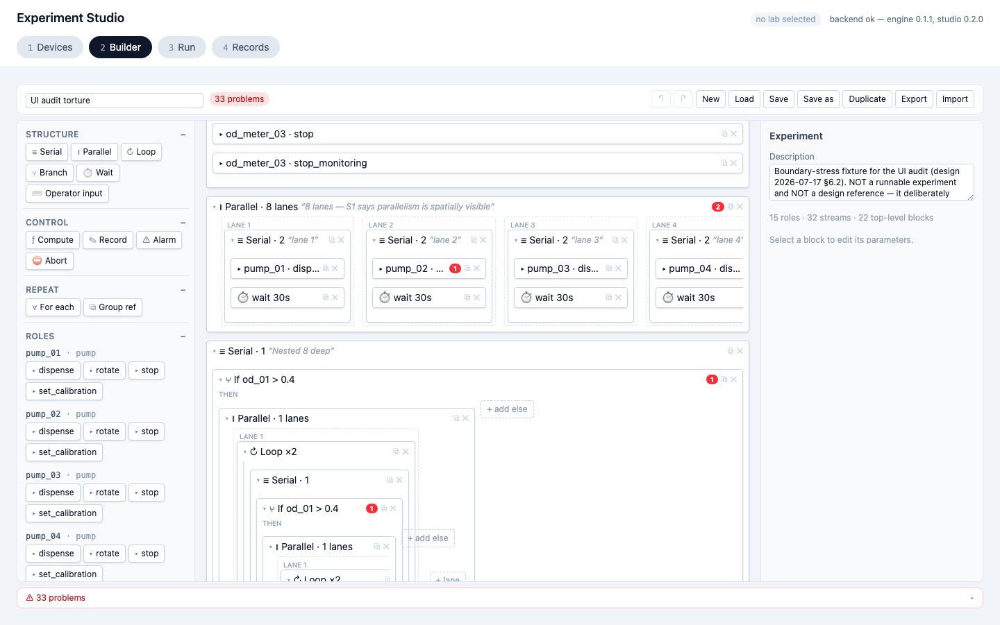

**What's wrong:** 14,207 interactive elements measured under 24px on an axis, heights clustering at
16px, with **0 rows** clearing 24px on both axes. The `▾` toggle at the head of every container —
the only way to collapse it — is 5.7px wide; the deep-nesting capture shows dozens of these tiny
toggles stacked down the tree.
**Why it matters:** collapsing/expanding structure is a core navigation gesture on a dense workflow,
and its target is the smallest in the app. Scored a *suspicion* because a dense professional tool
may deliberately trade target size; the finding is the pattern, not 14,207 independent problems.
**Suggested fix:** enlarge the collapse toggle's hit area at `Canvas.tsx:193` without necessarily
changing the glyph size.

### 4. Card text truncates with an ellipsis and no `title`, so it can't be recovered
**Component:** block summary and label on canvas cards · **Track:** mechanical (measured).
**File:** `builder/Canvas.tsx:198` (summary, 1,211 rows), `:199` (label, 179 rows). **Viewport:** all
three.

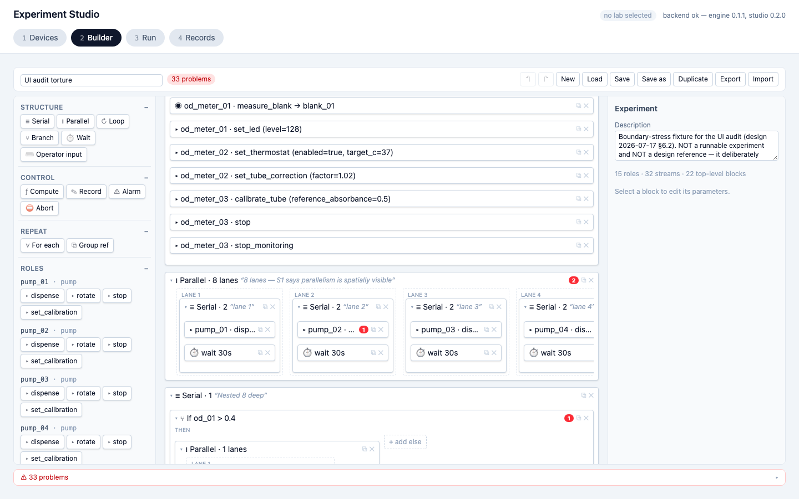

**What's wrong:** ordinary card text overflows the ~350px card with a CSS ellipsis and no
`title`/`aria-label`, so the clipped remainder is unrecoverable (the W7 truncate-no-title bug class,
Track A A4). The lanes screenshot shows it directly: `pump_01 · disp…`, `pump_03 · dis…`,
`pump_04 · dis…` are all cut mid-phrase.
**Why it matters:** this reaches the realistic demo (morbidostat-main 108 + morbidostat-group 100
rows), not just the torture fixture — a user building a normal workflow cannot read a block's full
parameters. Preprod adds a Records instance: real experiment names such as
`Morbidostat (demo speed) — 2026-07-13 10:09` truncate inside a `max-w-64` cell with no `title`.
**Suggested fix:** add `title={...}` on the summary/label spans at `Canvas.tsx:198-199` (and the
Records cell).

### 5. "Gap after" is hidden for blocks parented by `loop`/`branch`, though the engine honors it
**Component:** Inspector — Timing & Label · **Track:** judgment (verified against the engine).
**File:** `builder/Inspector.tsx:131`. **Viewport:** all.

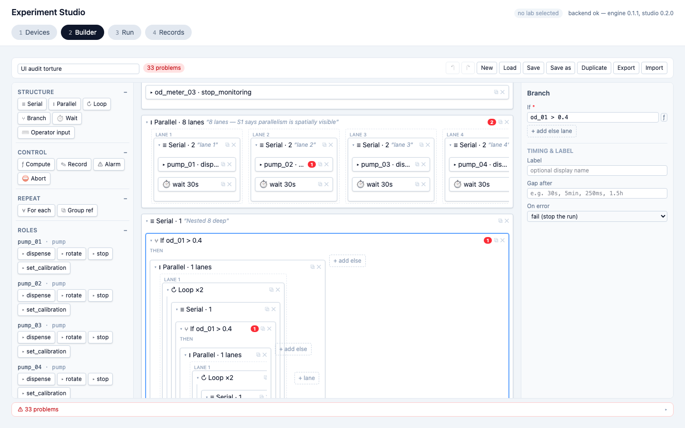

**What's wrong:** `Inspector.tsx:131` gates the "Gap after" row on `parentKind === null ||
parentKind === 'serial'`. Blocks whose parent is `loop` or `branch` hold sequential children
directly (no Serial wrapper, per `tree.ts:157-176`), so they never show the field — yet the engine
honors `gap_after` there: `execute.py:451 execute_blocks` ("gap_after honored unconditionally") is
the single runner shared by serial, loop body, branch then/else, and group body;
`validate.py:117-120` rejects `gap_after` **only** on the `for_each` block itself (the negative
control that proves the check is real). *Note: the pictured Branch block shows the "Gap after" row
because its own parent is serial — the defect is that a block nested directly inside this branch's
then/else arm omits it. No captured state selects such a child, so the screenshot shows the control
that should also appear one level down, not the absence itself.*
**Why it matters:** this hits the realistic demo — `examples/morbidostat.json`'s outer loop body
directly holds two aborts, a nested loop, a for_each and a parallel as un-wrapped children; opening
any in the Inspector silently omits a delay the engine would honor, with no explanation. (The
`start_offset` half of the raw finding was refuted: `execute.py:775` applies `start_offset` only in
`_parallel_child`, so hiding it outside parallel is correct.)
**Suggested fix:** treat `parentKind` `loop`/`branch` as gap-after-eligible at `Inspector.tsx:131`,
or explain the omission as `for_each`'s is explained at `:129-130`.

### 6. On a roster-fetch failure, the central panel invites the wrong action
**Component:** DevicesTab empty/error state · **Track:** judgment.
**File:** `builder/../devices/DevicesTab.tsx:41-45` (sidebar error), `:79-82` (central placeholder).
**Viewport:** 1440×900.

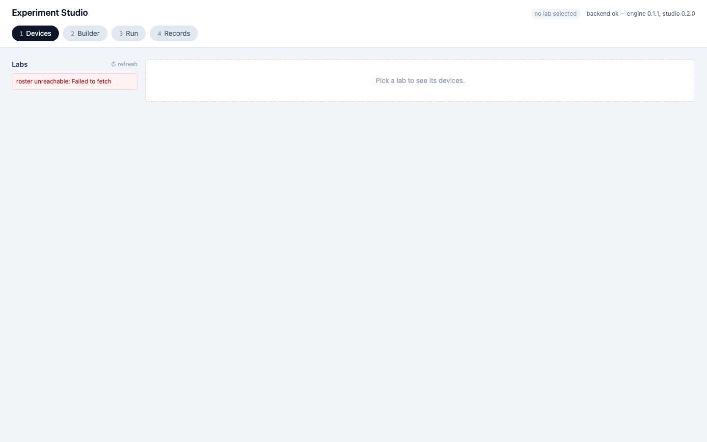

**What's wrong:** when the labs fetch fails, the sidebar shows a red "roster unreachable: Failed to
fetch" box, but the large central panel still reads "Pick a lab to see its devices." — because
`DevicesTab.tsx:79-82` branches only on `s.selected === null`, never on `s.labsError`. The biggest
message on screen points the user at a list that is empty *because the fetch failed*.
**Why it matters:** the actionable fact (the roster is unreachable) sits in a small sidebar box
while the dominant message invites a futile action.
**Suggested fix:** when `s.labsError` is set, swap the central placeholder for error-specific copy.

### 7. The roster-level error has no retry, though its sibling device error does
**Component:** DevicesTab error banners · **Track:** judgment.
**File:** `devices/DevicesTab.tsx:41-45` (roster error, no retry), `:104-110` (device error, has an
inline "retry" link). **Viewport:** 1440×900.

**What's wrong:** the roster-level error banner has no retry affordance, while the device-level error
banner pairs its message with an inline "retry" link. The `↻ refresh` link sits above the error box
entirely, not inside it — not a substitute.
**Why it matters:** two fetch-failure classes with identical recovery semantics get asymmetric
affordances, and the more upstream failure (the whole roster) gets the weaker one.
**Suggested fix:** add a retry link inside the `labsError` banner, mirroring `DevicesTab.tsx:107-109`.

### 8. A multi-second rediscovery is indistinguishable from the ready state
**Component:** DevicesTab discovering state · **Track:** judgment.
**File:** `devices/DevicesTab.tsx:96-101` (button label), `:113-160` (device table, never dimmed).
**Viewport:** 1440×900.

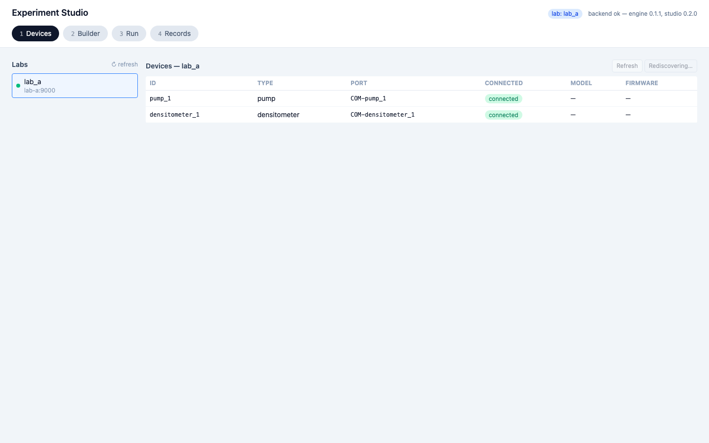

**What's wrong:** during a rediscover the only visual change is the button label flipping to
"Rediscovering…" with disabled styling; the device table is not dimmed or badged stale, and there
is no page-level in-flight indicator. The app's own confirm copy (`DevicesTab.tsx:20`) says "It
takes a few seconds," so production rediscovery genuinely occupies this state for a real user. (The
3s capture delay is a FakeLab artifact, but the state is real.)
**Why it matters:** a user glancing rather than reading a 12px button label cannot tell a
multi-second operation is in flight — the screen reads identically to ready.
**Suggested fix:** surface a page-level indicator while `s.discovering` is true, or dim the table.

### 9. A lab's online/offline status is carried only by a faint dot
**Component:** DevicesTab labs list · **Track:** judgment (preprod). **File:**
`devices/DevicesTab.tsx:61-66`. **Viewport:** 1440×900 (preprod).

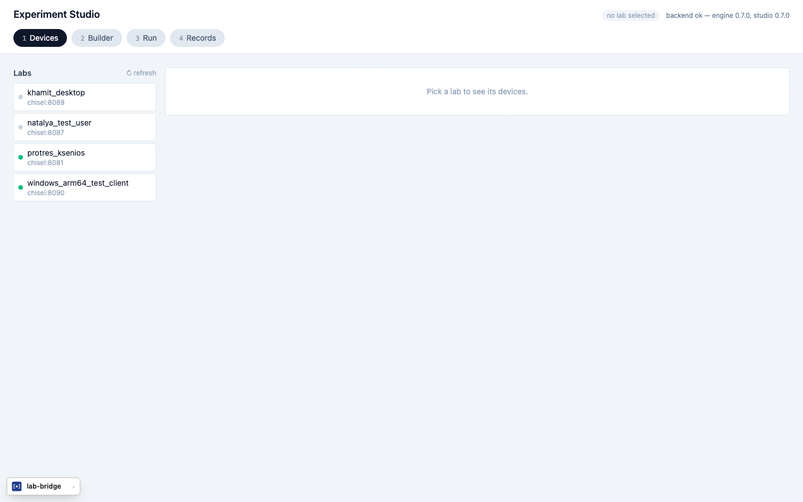

**What's wrong:** the only signal that a lab is offline is the status dot's fill — `bg-emerald-500`
vs `bg-slate-300` at ~1.49:1 — while the online/offline word lives in a hover-only `title`
attribute. On the real roster, `khamit_desktop` and `natalya_test_user` (offline) differ from
`protres_ksenios` and `windows_arm64_test_client` (online) by that faint dot alone. This applies the
Track A slate-300 pair as a *status* semantic (reachability), the distinct consequence beyond the
raw contrast measurement.
**Why it matters:** whether a lab is reachable — the first thing a user needs before selecting it —
is encoded by a low-contrast colour difference with no persistent label.
**Suggested fix:** add a persistent "offline"/"online" label or darken the offline dot
(`slate-400/500`).

### 10. A 30+ stream document has no way to search, filter, or jump
**Component:** StreamsPanel · **Track:** judgment (live-verified). **File:**
`builder/StreamsPanel.tsx:39-127`. **Viewport:** 1440×900.

**What's wrong:** with 32 streams the panel is one flat `ul` inside the aside's scroll region
(scrollHeight 2946px vs clientHeight 664px; only ~1 row fully visible at a time) with no search,
filter, or grouping. This directly answers the §8 re-examination question — does a name+units list
stay navigable at 30+ streams? — with *no*. It is distinct from the settled decision (which concerns
which *fields* a row shows, not search tooling).
**Why it matters:** a user editing a large doc must hand-scroll a flat list to reach or filter a
stream.
**Suggested fix:** add a text filter above the list (mirroring LoadDialog's search box) at
`StreamsPanel.tsx:39`.

### 11. The "+ lane" button is painted over an adjacent card's ⧉/✕ icons and steals their clicks
**Component:** Canvas ParallelLanes vs block card · **Track:** mechanical + behavioural (live click
proven). **File:** `builder/Canvas.tsx:307-318` ("+ lane") vs `:215/:225` (a sibling card's ⧉/✕).
**Viewport:** **1280×800 only.**

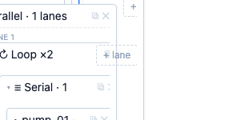

**What's wrong:** at 1280×800, in `inspector/loop` and `inspector/branch`, the "+ lane" button is
painted directly over a neighbouring Loop card's ⧉ Duplicate and ✕ Delete icons, covering them
100%. `document.elementFromPoint` at each icon's own centre returns the Add-lane button, and a
scripted click on the ⧉ icon's centre changed the block count by exactly **+1** (a new empty serial
lane) instead of duplicating the Loop's subtree — the icon's click is stolen. This is the **one real
overlap** among 973 geometric ones: it survived the clip-aware sweep, `elementFromPoint`, and a real
click. *The direct evidence is the 1280×800 crop above; the 1440 inspector shots do not exhibit the
overlap, because it is viewport-specific.*
**Why it matters:** a user aiming at Delete or Duplicate on that card silently gets a new lane — a
data-affecting misclick. It is the narrowest S2 by reach (2 states, one viewport) but the most
consequential by effect.
**Suggested fix:** reserve horizontal space for the "+ lane" button in the lane strip so it cannot
land under an adjacent card's action icons (`Canvas.tsx:277` strip / `:307` button).

---

## S3 — polish

### 12. The per-card problem-count badge fails AA contrast
**Component:** on-canvas problem-count badge · **Track:** mechanical (measured). **File:**
`builder/Canvas.tsx:204`. **Viewport:** all three.

**What's wrong:** white text on `red-500` (rgb 251,44,54) measures **3.81:1** at font-size 10px; the
large-text 3.0 floor does not apply at that size, and AA needs 4.5:1. The red "2" on the Parallel
card and "1" on a lane card in the screenshot are the affected badges. 792 measured rows.
**Why it matters:** the canvas's only per-card error signal is below AA.
**Suggested fix:** darken the badge background or enlarge the numeral at `Canvas.tsx:204`.

### 13. The "add role" controls are the shortest targets in the Palette
**Component:** Palette AddRoleForm · **Track:** judgment (live-verified). **File:**
`builder/Palette.tsx:86-107`. **Viewport:** 1440×900.

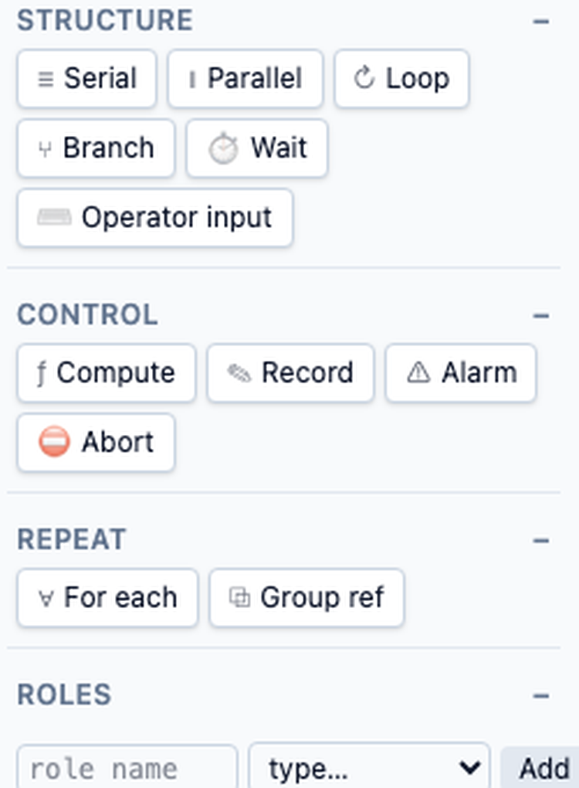

**What's wrong:** the role-name input, type select, and Add button use `py-0.5` versus the
Chip/Toolbar `py-1`, rendering ~20px tall — visibly shorter than every Palette chip above them (the
crop above, from `builder/empty`, shows the `role name / type… / Add` row dwarfed by the Serial /
Parallel / Loop chips). The AddRoleForm renders in the Palette across every Builder state.
**Why it matters:** the control that creates a new role — the entry point for populating the
Palette — is the smallest target in the panel.
**Suggested fix:** match the row padding to the chip standard (`px-2 py-1`) at `Palette.tsx:86-107`.

### 14. The two Toolbar state signals convey meaning by faint colour alone
**Component:** Toolbar state indicators · **Track:** mechanical (measured). **File:**
`builder/Toolbar.tsx:33` (validating chip), `:165` (unsaved dot). **Viewport:** 1440×900.

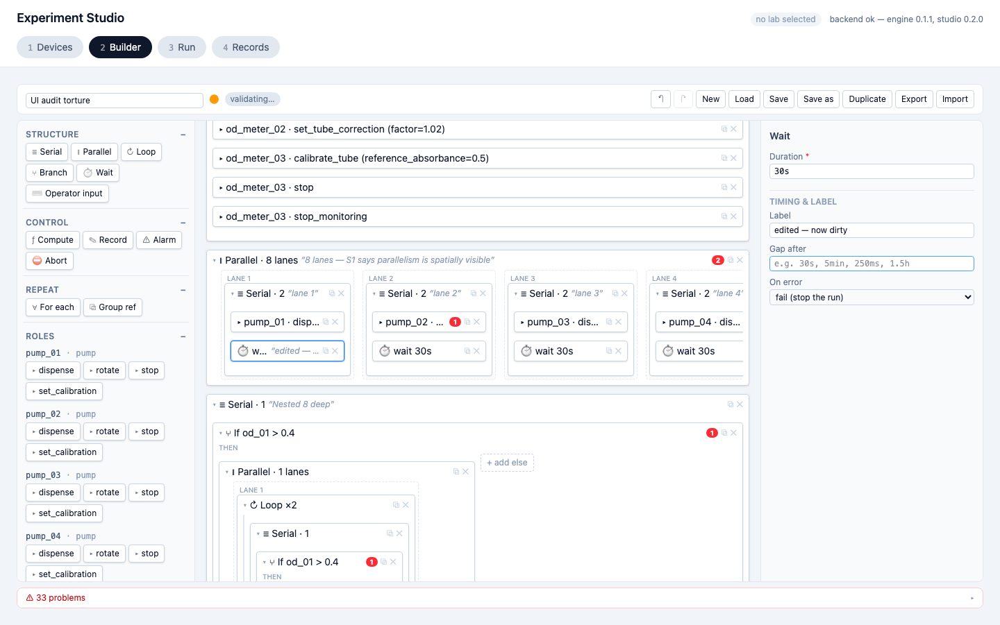

**What's wrong:** the "validating…" chip (slate-500 on slate-200) measures **3.86:1** and the amber
unsaved-changes dot ● (amber-500 on white) measures **2.13:1** — below even the 3:1 non-text-graphic
floor. Both are visible in the dirty capture, beside the experiment-name field. Neither is among
Track A's root-cause colour pairs.
**Why it matters:** the only two signals for "validation running" and "unsaved changes" are conveyed
by faint colour.
**Suggested fix:** darken the chip text (slate-600/700) and the dot (amber-600) at
`Toolbar.tsx:33,165`.

### 15. "Into stream" is authored differently by Measure and Record
**Component:** Inspector — Measure vs Record "into stream" row · **Track:** judgment. **File:**
`builder/Inspector.tsx:387-449` (Measure IntoPicker), `:746-763` (Record ValueForm). **Viewport:**
1440×900.

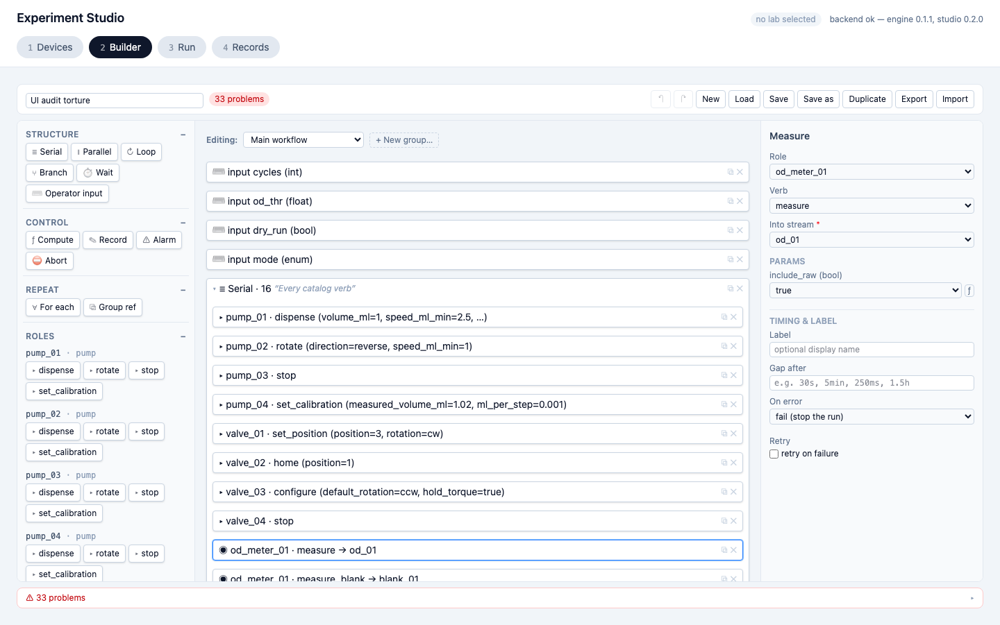

**What's wrong:** Measure's row is a picker over declared streams *plus* an inline "+ new stream…"
mini-form, labelled "Into stream" (shown in the screenshot). Record's row is a picker only, labelled
"Into (stream)," with a passive amber note pointing at the Streams panel when none exist. Same
conceptual "write into a stream" row, divergent affordances and wording.
**Why it matters:** a user who learns "pick or create a stream inline" from Measure hits a
picker-only path in Record. (Downgraded S2→S3: Record's note signposts the Streams-panel
alternative, so it is a convenience gap with a guided path, not a hard dead end.)
**Suggested fix:** unify the label wording and give Record the same inline "+ new stream…"
affordance at `Inspector.tsx:746-763`.

### 16. Every stream's source tag looks the same, so "unused" doesn't stand out
**Component:** StreamsPanel source tag · **Track:** judgment. **File:**
`builder/StreamsPanel.tsx:85-88`. **Viewport:** 1440×900.

**What's wrong:** the per-stream source tag renders identically for every state
(`bg-slate-200 text-slate-500`): `measure`, `record`, and `unused` all get the same neutral grey
badge (see `od_01 measure` and `od_02 unused` in the screenshot).
**Why it matters:** "unused" — a declared-but-never-written stream — is the one state worth flagging
while scanning, yet it carries no visual signal.
**Suggested fix:** give the "unused" case a distinct tint (e.g. amber) at `StreamsPanel.tsx:85-88`.

### 17. The run chart repeats x-axis tick labels for the first ~20 seconds
**Component:** StreamChart · **Track:** judgment (live-verified). **File:** `records/StreamChart.tsx:38`,
`records/format.ts:14`. **Viewport:** 1440×900.

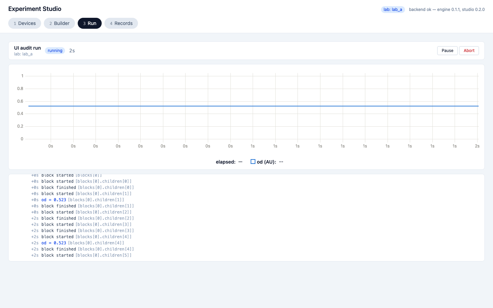

**What's wrong:** early in a run the x-axis reads `0s ×9, 1s ×10, 2s`, because `StreamChart.tsx:38`
pipes every uPlot tick through `formatElapsed → Math.floor` to whole seconds, collapsing ~20
sub-second ticks on a 0–2s domain. The screenshot shows the repeated `0s`/`1s` labels directly. It
self-resolves by ~20s.
**Why it matters:** the x-axis reads as noise in the first seconds of every run/pause — when "is
this progressing?" matters most. (Downgraded S2→S3: transient; the chart line and legend elapsed
stay legible.)
**Suggested fix:** dedupe consecutive equal tick labels, or give uPlot an explicit `splits` function
at `StreamChart.tsx:38`.

### 18. Role rename/delete errors surface in one shared slot, not next to the failing row
**Component:** RolesPanel · **Track:** judgment. **File:** `builder/RolesPanel.tsx:93`. **Viewport:**
1440×900.

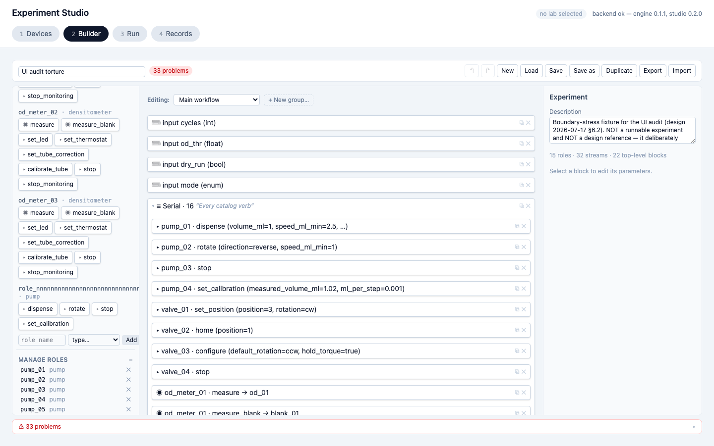

**What's wrong:** rename/delete errors for any role surface in one shared slot appended after every
row, never beside the row whose action failed. *No error is triggered in the captured state, so the
screenshot shows the roles list where the single shared slot would appear, not a live error message
— the finding is structural (one slot at `RolesPanel.tsx:93` for all rows).*
**Why it matters:** in a list of a dozen roles, feedback for a failed rename appears far from its
cause with no row highlight.
**Suggested fix:** show the error inline under the specific row, or highlight that row.

### 19. The LoadDialog's primary "open" action has no hover state
**Component:** LoadDialog row · **Track:** judgment. **File:** `builder/LoadDialog.tsx:97` (open
button), `:103-116` (Export/Delete icons). **Viewport:** 1440×900.

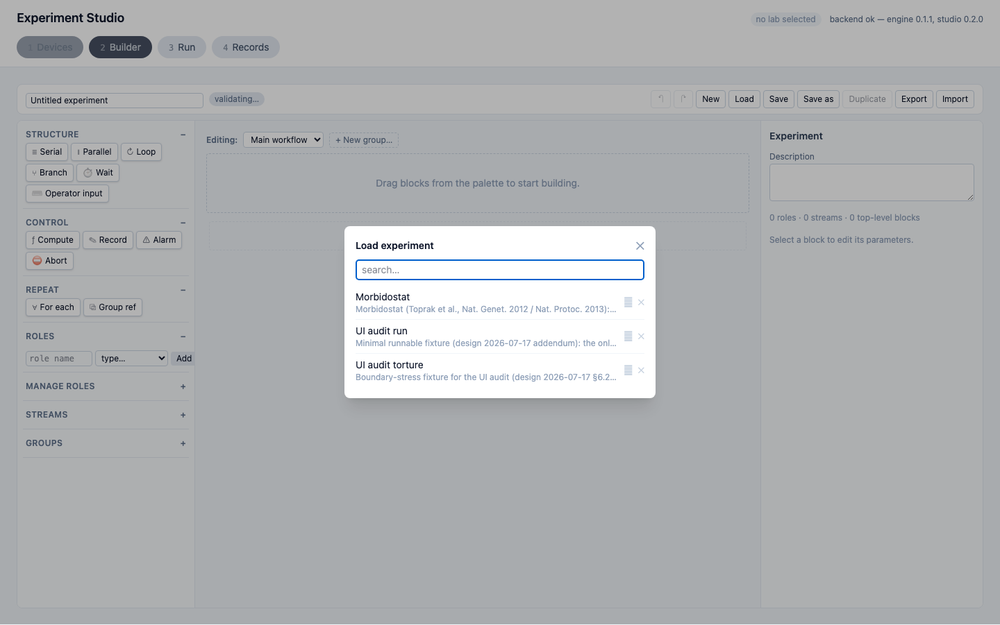

**What's wrong:** the row's primary action (open experiment) is a plain text button with no hover
state, while the Export and Delete icon buttons beside it both get hover colours.
**Why it matters:** the most important action in the dialog is the least visually indicated,
inverting the expected hierarchy.
**Suggested fix:** add a hover background/border to the row button at `LoadDialog.tsx:97`.

### 20. LoadDialog names/descriptions truncate with no `title`
**Component:** LoadDialog row · **Track:** mechanical (the A4 truncate class, in a component Track
A's local counts did not reach). **File:** `builder/LoadDialog.tsx:98-101`. **Viewport:** 1440×900.

**What's wrong:** experiment name and description truncate with a CSS ellipsis and no
`title`/`aria-label` (the Morbidostat description is visibly clipped in the screenshot).
**Why it matters:** right before a destructive Delete, two experiments that differ only past the
clip point cannot be told apart.
**Suggested fix:** add `title={item.name}` / `title={item.description}` at `LoadDialog.tsx:98-101`.

### 21. The LoadDialog scrolls its header and search out of view with a long list (latent)
**Component:** LoadDialog · **Track:** judgment (latent). **File:** `builder/LoadDialog.tsx:76`.
**Viewport:** 1440×900.

**What's wrong:** the dialog's outer wrapper carries `overflow-y-auto` on the whole box, wrapping
header + search input + close button + results `ul` under one scrollbar. Past ~a dozen saved
experiments, scrolling the list also scrolls the search box and close button out of view. *This is a
latent code defect with zero impact in the pictured 3-experiment fixture — there is no scrollbar in
the captured state — so the screenshot shows the component, not the failure.*
**Why it matters:** the search/close controls become unreachable while scrolling a long list.
**Suggested fix:** make the header + search sticky and give only the `ul` its own `overflow-y-auto`
at `LoadDialog.tsx:76`.

### 22. "✓ workflow valid" reads as go while Start is disabled by incomplete mapping
**Component:** PreflightPanel · **Track:** judgment (live-verified). **File:**
`run/PreflightPanel.tsx:174` (the green check, keyed on `diagnostics.length === 0` at `:99`), `:100`
(`canStart` also needs `mappingComplete`). **Viewport:** 1440×900.

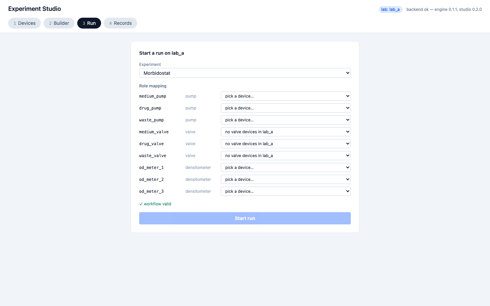

**What's wrong:** "✓ workflow valid" renders above a disabled "Start run" while 8 roles show "pick a
device…" / "no valve devices in lab_a." `canStart` requires `mappingComplete`, which the green check
ignores, so the check reads "good to go" but Start is disabled and nothing states the mapping is what
blocks it.
**Why it matters:** the strongest positive signal on the panel is contradicted by the disabled
button, with no explanation of the gap. (Downgraded S2→S3: the labelled "Role mapping" placeholders
do communicate the incomplete mapping.)
**Suggested fix:** gate "workflow valid" on `canStart`, or add an explicit "N roles unmapped" line at
`PreflightPanel.tsx:172-175`.

### 23. The two refresh actions on the Devices tab have different affordance weights
**Component:** DevicesTab · **Track:** judgment. **File:** `devices/DevicesTab.tsx:33-39` (labs "↻
refresh" text link), `:88-94` (devices "Refresh" bordered button). **Viewport:** 1440×900.

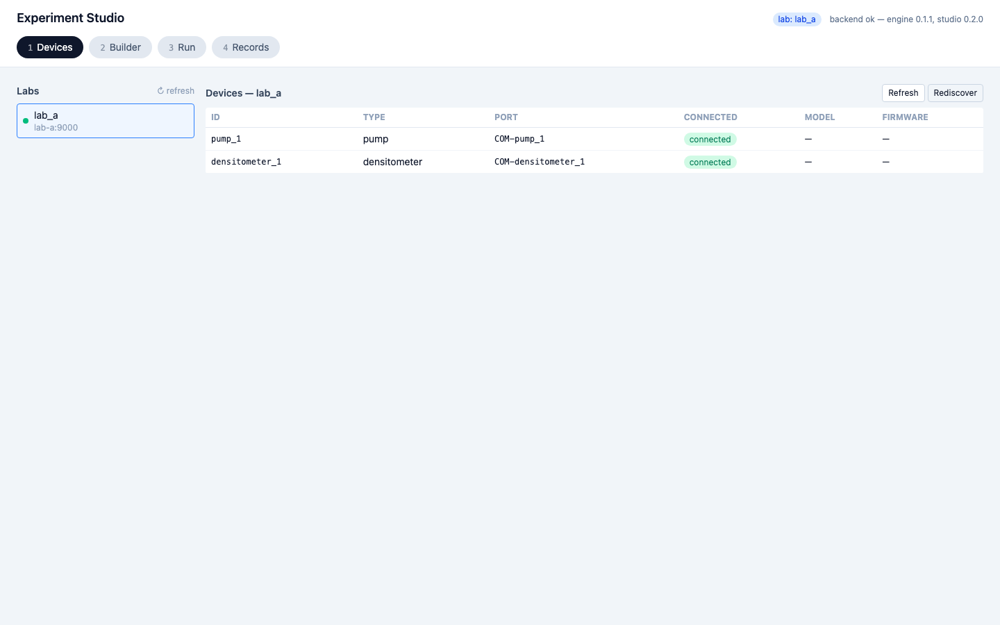

**What's wrong:** within one tab the Labs refresh is an unbordered text link while the Devices
refresh is a bordered button — two affordance weights for the same conceptual action, side by side
(both visible in the screenshot).
**Why it matters:** the labs-refresh link reads as less clickable than its sibling button a few
pixels away.
**Suggested fix:** style both refresh actions the same way.

### 24. A fatal run error is styled like a recovered warning
**Component:** RecordViewer error banner · **Track:** judgment (preprod, live-verified). **File:**
`records/RecordViewer.tsx:82-101` (fatal error box, amber), `:106/:121` (the non-fatal
tolerated-errors / alarms panels, also amber), `run/RunView.tsx:103` (the live view renders the same
error in red). **Viewport:** 1440×900 (preprod).

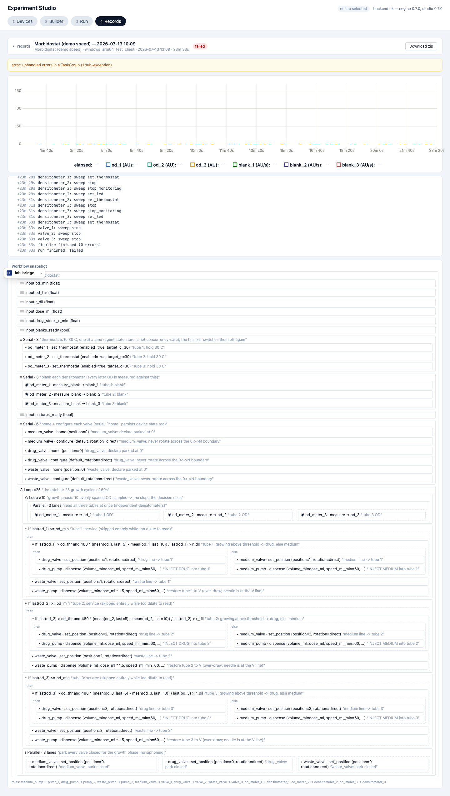

**What's wrong:** on the real failed run the header chip is red "failed," but the fatal error body
"error: unhandled errors in a TaskGroup" renders in an **amber** box — the same amber family used for
the explicitly non-fatal tolerated_errors and alarms panels. The sibling live view renders the
identical `report.error` in **red**, so this is an internal inconsistency.
**Why it matters:** a run-killing exception is styled like a recovered warning. (Downgraded S2→S3:
the box begins with "error:", the red "failed" chip sits directly above, and the app never relies on
colour alone.)
**Suggested fix:** give the fatal-error box a red treatment matching `RunView.tsx:103` and the
"failed" chip; keep amber for tolerated_errors/alarms.

---

## Settled decisions, re-examined

The design doc's §8 lists ten decisions already settled in earlier increments. Settled items stay
out of the findings above; this section carries a verdict for each, because the user asked to
double-check the settled list and fold the result into the final report. **Tally: 9 hold, 1 worth
revisiting.**

**The nine that hold:**

1. **Tabs stepper-styled but freely navigable** — holds. The pills are separated `rounded-full`
   chips with no connector chrome, low-weight mono numerals, and zero gating (`onClick` always
   enabled), so they read as a nav bar, not a gated wizard.
2. **No persistence knobs; streams panel = name + units** — holds. Each row is minimal (name, tag,
   `w-14` units, delete), which is precisely what keeps a 30+ stream list scannable; a per-stream
   persistence control would double row height. (The separate *no-search* gap is published as
   finding 10.)
3. **`for_each` authored view only, no expansion preview** — holds. An inline-literal card is
   self-describing (`∀ For each tube in [1, 2, 3]`); when not inline-able it degrades to a count but
   the Inspector's Items field + hint state the splice semantics. A rendered preview would just
   duplicate the canvas.
4. **`for_each` Inspector omits retry/on_error/gap_after/start_offset** — holds. The absence is
   *explained*: the Inspector still renders a Timing & Label section and the hint "each copy is
   spliced into the list for_each sits in" tells the author it is a macro with no runtime block to
   attach a policy to.
5. **Control glyphs ƒ ✎ ⚠ ⛔ (non-arrow)** — holds. Four visually distinct marks read as one section
   because the chrome (a "CONTROL" header over identically-styled pills) unifies them; abort's
   heavier red mark correctly signals the only destructive verb.
6. **`∀ For each` / `⧉ service(tube=1)` cards** — holds. Zoomed in, `∀` renders unambiguously and
   never carries meaning alone — "For each" is spelled beside it; its job (being distinct from
   loop's `↻`) succeeds.
7. **Emerald note, never red, for unopenable imports** — holds, verified both by source and by
   browser. A constructed genuinely-unopenable doc (an unknown block type `frobnicate`) imported
   with the note's container class `truncate text-xs text-emerald-700` and **0** `text-red-600`
   spans on the page — the doc is saved and runnable, just not renderable as a block tree, and the
   emerald copy leads with what succeeded.

   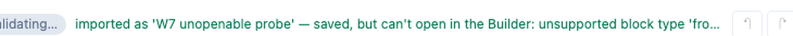

8. **`record.into` = picker over declared streams, not free text** — holds. In `ValueForm`, `record`
   renders a `<select>` bound to `node.into` over `Object.keys(streams)` with an amber "no streams
   declared" hint; only `compute.into` is free text (it writes a binding, not a stream).

**The borderline hold:**

9. **`abort` renders no On-error row** — holds, but it is the weakest of the ten. Unlike `for_each`
   (item 4), abort gives **no dedicated note** for the missing row — a genuinely *silent* absence.
   It still holds because abort is itself the terminal error path: an "on error, continue" handler on
   a block whose whole job is to stop the run is near-nonsensical, and the hint "True stops the run:
   devices are swept safe and the run ends 'aborted'" conveys that terminality. Worth a one-line
   splice-style hint if the panel is ever revisited, but no user-facing harm.

**The one worth revisiting:**

10. **Parallel renders as N side-by-side lanes** — **worth revisiting.**

    

    *Rationale on record:* parallelism is *spatially* visible (Blockly stacks arms vertically).
    *Because:* at the judgment viewport (1440×900) only 4 of the 8 lanes are visible and lane 4 is
    already clipped mid-card (`pump_04 · dis…`, `wait 30s` cut at the panel edge) — lanes 5–8 sit
    entirely behind a horizontal scrollbar. The probe records an `unexpected-scroll {axis:"x"}` on
    the lane strip at **all three** probe viewports — 1024, 1280, **and 1920** — so the 8-lane strip
    overflows even at the widest supported width, not just the narrow one; at 1024 only ~2 lanes fit.
    On top of the overflow, the clip-aware sweep traced the one real overlap (finding 11) to this
    same strip's trailing "+ lane" button colliding with the next card's ✕/⧉ icons. So the rationale
    inverts at scale: the arrangement meant to make parallelism *spatially obvious* is the one that
    hides most of the lanes off-screen and stacks a control on an adjacent card. The decision is
    defensible for 2–3 lanes (morbidostat's parallels are ≤ 3 and fit at 1440); it degrades badly at
    the fixture's documented 8-lane boundary. Revisit — e.g. lane wrapping, a lane-count affordance,
    or reserving the "+ lane" gutter. Not a bug: a boundary the current layout does not hold.

---

## Method & coverage limits

**The two tracks.** Track A drove all 42 states at 3 viewports and ran a mechanical probe (contrast,
target size, truncation, overlap, clipping, unexpected scroll), emitting 36,873 rows; grouping by
root cause collapsed those to the 5 measured defects (findings 1–4, 12) plus the one behaviourally
re-proven overlap (finding 11). Track B gave eight reviewers one component group each, the §5.3
rubric, and the §8 settled list; every raw finding then faced a skeptic that defaulted to *refuted*
and re-checked it live, killing 23 of 41. A finding appears above only if it survived its track's
scrutiny.

The full 36,873-row probe output is committed alongside this report as
`2026-07-17/probe.json.gz` (gzipped — 22 MB raw, so it is not kept uncompressed in the tree). It is
the mechanical evidence behind findings 1–4, 11, and 12; note that ~99.6% of its `overlap` rows are
the geometric false positives described in limitation (a) below, not defects.

**Honest limitations.** These bound what the audit can and cannot claim:

- **(a) The overlap probe rule is 99.6% false-positive — a future re-run must clip-test overlaps.**
  This is the single most important methodology caveat. The rule compares
  `getBoundingClientRect()`s, which are geometric and blind to clipping by an ancestor's
  `overflow:hidden`/`auto`. In the Builder, canvas cards scrolled past the fold report rects that
  extend into whatever is painted below, while being visually clipped away. Of 973 geometric
  overlaps, a clip-aware re-sweep (intersect each rect up its clip chain, then confirm with
  `document.elementFromPoint`) found **only 4 real ones** — all the single defect in finding 11.
  The two overlaps a prior task believed reproduced (the "problems bar over the last card" and the
  "+ lane" bucket at 1024) are **phantoms**: `elementFromPoint` returns the clipping element, not
  the card. Any future run must clip-test overlaps before reporting them.
- **(b) 1440×900 is the sole judgment viewport** (design §13). A layout that is fine at 1440 but
  ugly at, say, 1600 goes unseen unless a probe flags it at 1024/1280/1920. (The probe-only
  viewports have no PNG; where a finding's measured viewport differs — finding 11 at 1280 — the text
  says so and cites the crop that shows it.)
- **(c) No baseline.** This audit finds defects, not regressions; there is no prior-version capture
  to diff against.
- **(d) The probe is not a full accessibility audit.** It measures contrast, target size,
  truncation, and layout collisions — not keyboard order, ARIA semantics, or screen-reader flow.
- **(e) Real defects outside the probe's automated scope.** Two issues are real but the probe cannot
  score them automatically: **(i)** the app's dialogs (Load, Input) lack `role="dialog"`,
  `aria-modal`, and a focus trap — an accessibility gap the mechanical rules do not cover; and
  **(ii)** on preprod, the lab-bridge host-chrome widget (a `position: fixed` pill from the siteapp,
  not from `webapp/`) overlaps record content — on the long failed-run record it sits on top of the
  `roles: …` legend at ~90% scroll. That is a cross-repo integration bug belonging to
  `lab_devices_server`, not to Experiment Studio, and is noted here only so it is not rediscovered as
  a Studio defect.

*Version note:* the preprod capture ran against a health-gate-confirmed 0.7.0 deployment
(`{"library":"0.7.0","studio":"0.7.0"}`). The local devserver's header shows placeholder versions
(`engine 0.1.1, studio 0.2.0`) while running the audited 0.7.0 source checkout; the version in the
local screenshots' top-right is that dev stub, not the target.

---

## What was refuted (and why it matters)

The skeptic pass killed 23 of the 41 Track B findings. That is the point: the 24 that remain are the
ones that survived adversarial re-checking. Three refutations are worth showing, because each is a
different way a plausible finding turns out to be wrong.

- **R3 — the "drifting clock."** A reviewer found that a paused run's elapsed clock keeps ticking
  (`RunView.tsx` guards drift on `feed.terminal`, not `status==='paused'`) and proposed freezing it
  on pause. Live reproduction proved the behaviour is **correct**: displayed elapsed = the engine's
  monotonic elapsed at the last message + wall time since, and `runStore.ts:66` refreshes
  `lastWallMs` on every WS message. The engine's `MonotonicClock` advances *through* a pause and
  keeps emitting, so the extrapolation tracks reality — Resume showed **no jump**. The proposed
  "fix" would have *introduced* the very jump it feared. A finding that, if published and
  implemented, would have broken a working feature.
- **P1 — "the ProblemsPanel under-shows its own count."** The claim ("no N-of-33 counter") was
  factually **false**, proven by live DOM inspection: the total is shown twice, persistently — the
  "⚠ 33 problems" toggle renders *outside* the scroll region and stays fixed above the list, and the
  Toolbar shows a duplicate "{count} problems" pill in the always-visible top strip. The real
  `max-h-40` scroll cap is a far narrower issue than the argued one.
- **C3 — "branch then/else should get parallel's dashed box."** Refuted because the fix would
  *harm*: parallel lanes run concurrently, and the dashed box is precisely what makes concurrency
  spatially visible (settled S1); branch then/else are mutually exclusive. Giving branch arms the
  same box would falsely imply concurrency. The differing styling is correct, not an inconsistency.

These three — a proposed fix that would introduce a bug, a claim that was simply false on inspection,
and a change that would actively mislead — are why the remaining 24 findings are reported with
confidence.
