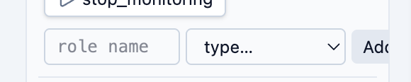

# UI improvements

## 1 
Element library, experiment canvas and block settings form are sitting inside one big box with rounded corners, but separated only by vertical lines. It should look much better if each become separate box with rounded corners and some space between

## 2
In "roles" section of element library "add" form components alligned in one line and overflow element library container triggering horizontal scroll (screenshot). Horizontal scroll in components like elements library is akward UX, we should avoid it when it is possible. But may be you should not fix it due to redesign describded below, just keep in mind this issue to not repeat it.

"Roles" section can be redesigned in following way:
Block for each device type: selectable buttons representing roles (acting like radio) + actions block to drag-and-drop from. "Create role" forms can become part of device type block. If there are no roles for device type - don't show actions, just suggest to create one.
This design prevent "roles" section from becoming too long for many devices of the same type.

"manage roles" section looks redundant in this context for me. it allows only to rename and delete roles. I think this features can be implemented as pencil and cross buttons on role badge inside “roles” section, or it will overload UI? Help me as a designer

## 3
Header now is two rows:
- heading on the left and platform info on the right
- navigation
It is sparce layout that takes vertical space. I want to include navigation into header and make it look like tabs, so layout would be: heading (or logo) -> navigation tabs -> place for some platform info.

# 4
Parallel lanes cannot not be created empty using UI, only with Serial group inside (and deleting it leads to lane destruction). This is not ok, lanes can and should be empty, user decide what to put inside. Check other elements before fixing for the same problems
