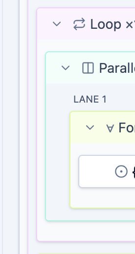
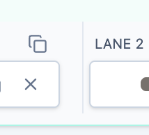
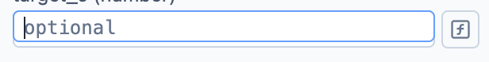
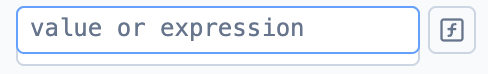
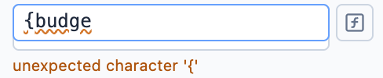

# Comments on UI Improvements 4

## 5

"Parallel" block still has some sort of spacers between lanes and on sides. This spacers both break left indentation for "parallel" block and make line separators between lanes spaced unevenly.

Also about line separators between lanes. line go up to the header of block (colored part). Lines should cover inner lane blocks hight except radiuses (exactly like it is done in toolbar)

## 12

What were fixed: "A lot of expression inputs (may be all) are only 20px high instead of 24px as all other inputs (see screenshot). This issue should be found and fixed everywhere!"

But this caused the second issue (see screenshot 13): active area height now fixed, but visible box is oversized now. You should make visible and active boxes consistent in size first and only after fix the size.

## 13

Still no autocomplete for bindings in expressions. Can we fix?

---

## Resolution (PR #81, UI improvements 5)

- **#5** — the horizontal `DropSlot` was 12px of invisible spacer sitting on one
  side of the hairline, with another on each outer edge. Drop slots are now the
  gutters themselves (8px at the row's ends, 16px between lanes with the
  hairline centred), and lanes and branch arms dropped their horizontal padding:
  every construct indents its content by exactly 8px, measured. The separator
  starts below the `LANE N` / `then` / `else` label row so it covers the cards
  instead of running into the tinted header, and `+ lane` has a divider of its
  own. Tokens live in `webapp/frontend/src/builder/laneLayout.ts`.
- **#12** — the painted box was the *wrapper*, which carried an inline-block
  line-box strut ~4px taller than the 24px input (measured: wrapper 28 /
  control 24). `textAreaClass()` is block-level now, so wrapper and control are
  the same box; probe rule R6 `control-wrapper-gap` keeps it that way — 66 hits
  across the capture states before the fix, 0 after.
- **#13** — the completion path lexed raw text, so `{` was a lex error (and one
  finished `{od}` killed completions for the rest of the line). It masks holes
  now, opens the hole list on `{` alone, replaces a complete hole rather than
  nesting braces, and matches holes on their inner name so a bare `tu` also
  reaches `{tube}`. An unfinished hole says so instead of quoting the character.
