# UI Improvements 4

## 1

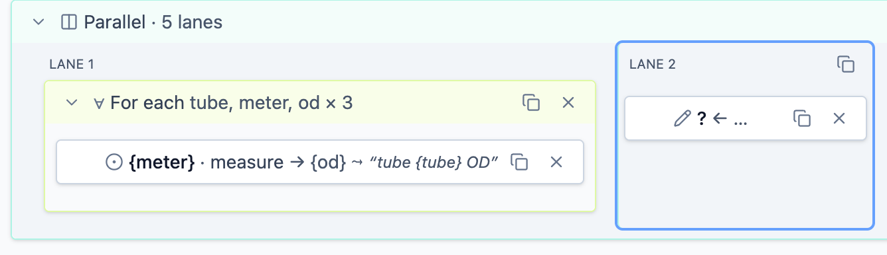

For imported workflow parallel lanes (first lane on screenshot) may not have controls (duplicate, delete) at all. This lane even is not selectable as a lane. Lanes should be feature-equivalent to each other, look and behave the same.

May be similar problem exists in other blocks too: check all possible places and fix everywhere.

## 2

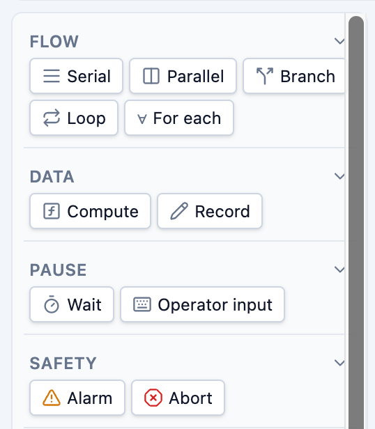

In the left menu sometimes scrollbar become very bold and don't disappear after scrolling. You should debug and fix. When you find the root cause check other elements for the same problem and fix.

## 3

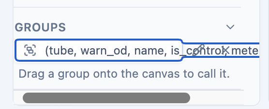
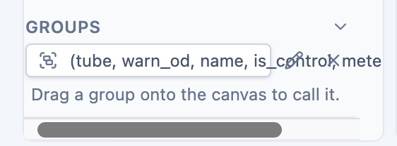

Group card content overflows the card. May be find a better way to place content on card?

## 5

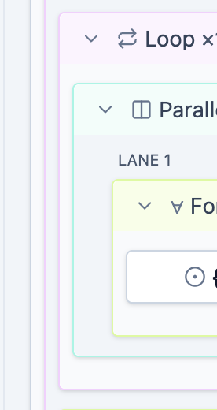

Left indentations are inconsistent between different blocks (screenshot). Check how inner content is spaced for all blocks and think how to make it consistent.

## 7

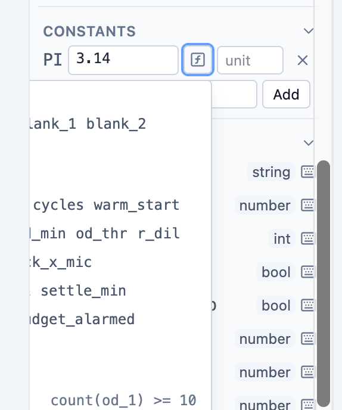

Expression help is hidden behind left menu (and even behind viewport). All similar components should be found and fixed. 

## 8

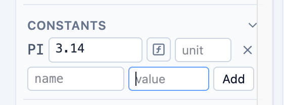

Constant creation form is inconsistent with constant edit form. In creation form there are no "unit" field, value feels like constant input in creation form, actually it is expression.

## 9

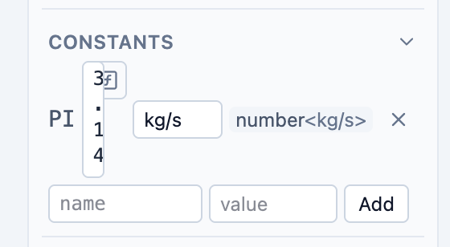

Form is broken. Find a way to fix.

## 10

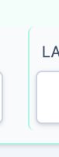
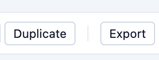

Line separators introduced in PR #70 are looks terrible (rounded corners, inconsistent spacing, etc) see first screenshot. It should be implemented like it is done in file management menu (see second screenshot). It should be fixed everywhere!

## 12

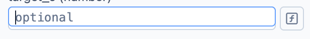

A lot of expression inputs (may be all) are only 20px high instead of 24px as all other inputs (see screenshot). This issue should be found and fixed everywhere!

## 13

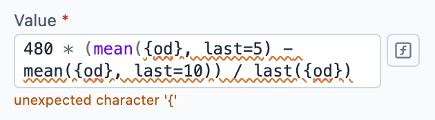
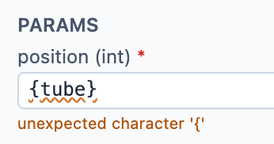

Expression validation does not work for bindings. Investigate this issue and fix everywhere!
