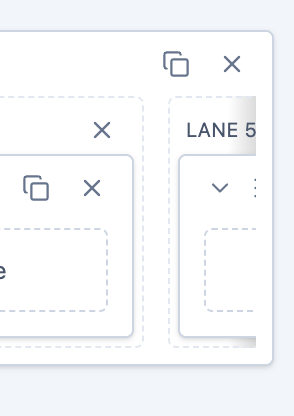
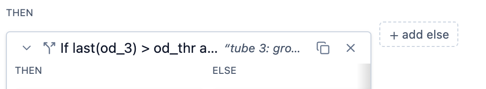
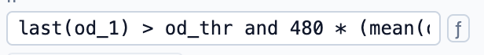
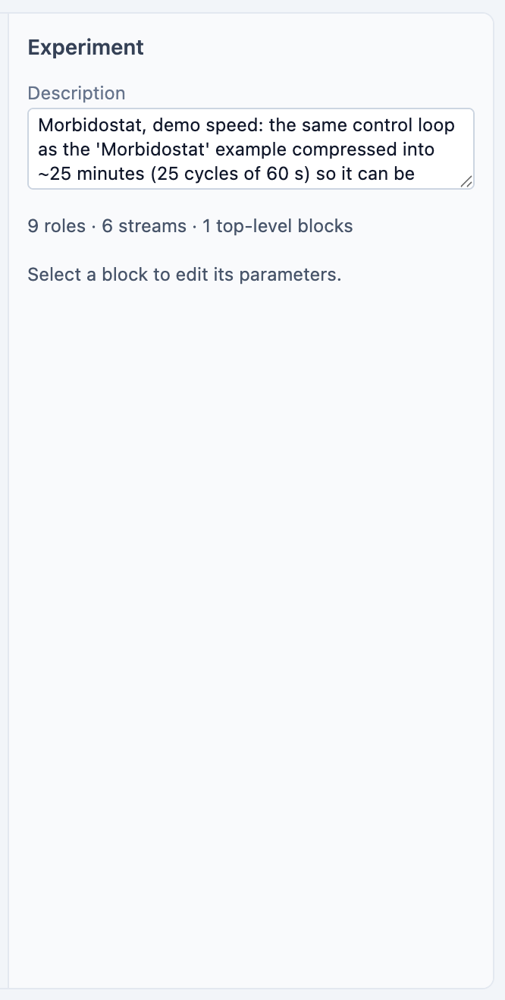
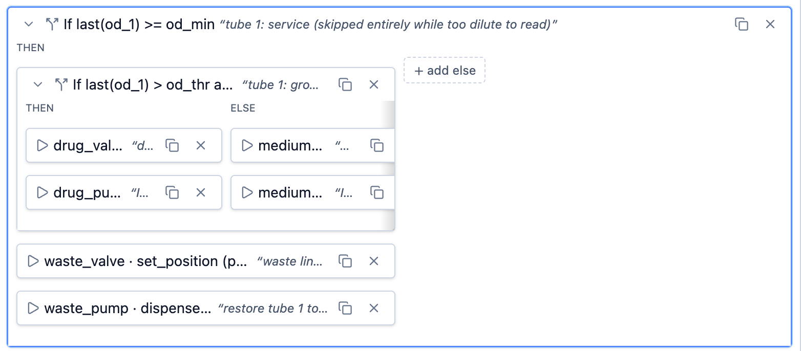
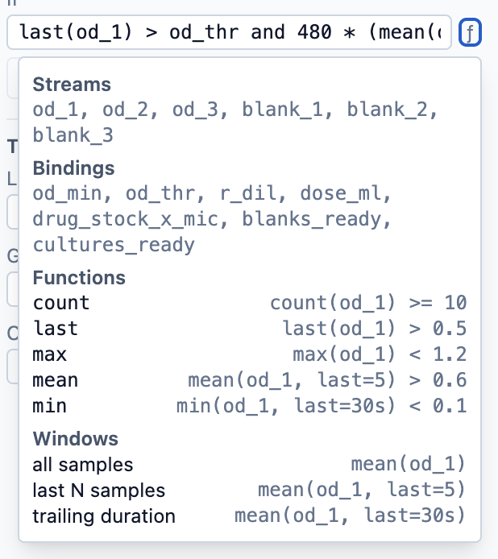

# UI improvements

## 1 
Block overflow gradient looks very bad (more like some artefact than feature).

Let's:
1. fix it to cover all inner elements and
2. Think how to signal user that he can scroll this block content horizontally (may be some shevrone or something better you suggest)

## 2
Let's group this buttons in logically similar sections to simplify user navigation.

## 3
" + add ... " and "f" button are missaligned with other blocks. You should check for other similar issues before fixing!
 I think " + add ... " buttons can be of inner block size to explicitly signal user that this button will add one more block.
 "f"

## 4
"prompt" form field acts like input field, not text. It is very hard to work with long prompts. Same problem with other fields too! I want you to inspect all fields for the similar problem before fixing.

## 5
Some blocks layouts looks very suboptimal
 Here two last lines can be sticky to bottom and text input fit the text until it has a free space (vertical scroll after)
 A lot of free space on the right side of root block, but inner block content is hidden (it may be hard to fix, but if possible, it will be great!)

## 6
Expression help does not close on click outside. May be there are similar problems with other similar components, check before fixing.

